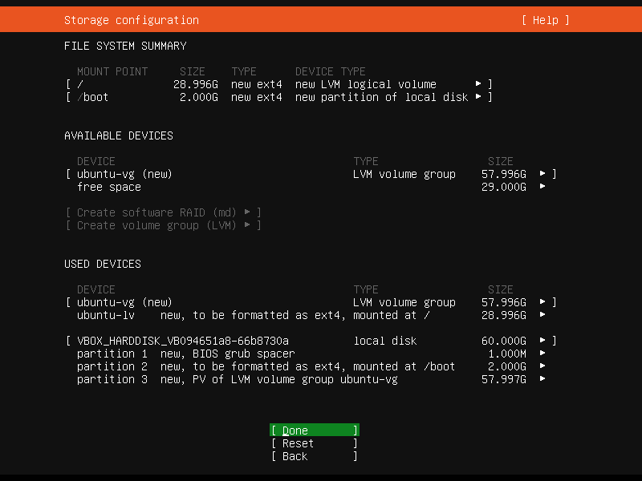
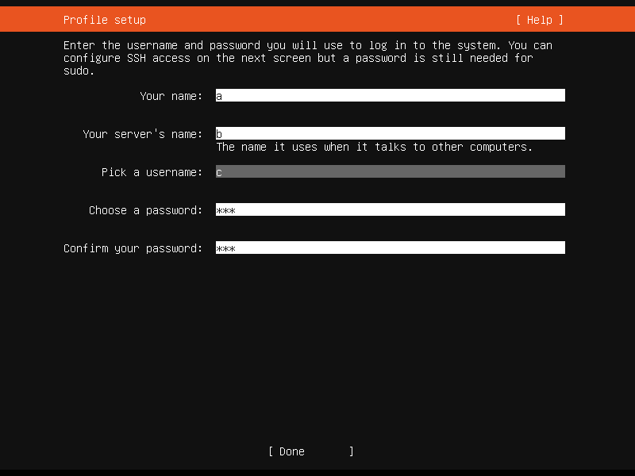

## 1 安装虚拟机系统

官网：https://www.virtualbox.org/

1. 下载并安装 VirtualBox

   ```
   https://download.virtualbox.org/virtualbox/6.1.38/VirtualBox-6.1.38-153438-Win.exe
   ```

   

2. 下载ubuntu

   官网[企业开源和Linux | Ubuntu](https://cn.ubuntu.com/)
   
   

3. 安装虚拟机系统

   
   
   
   
   
   
   
   
   
   
   
   
   
   
   
   
   
   
   
   
   
   
   
   
   
   
   
   
   
   
   
   
   
   
   
   
   > subnet: 0-255 --> .0/24
   
   
   
   
   
   
   
   
   
   
   
   
   
   
   
   
   
   
   
   
   
   
   
   
   
   
   
   
   
   虚拟机访问外网测试
   
   
   
   虚拟机与宿主机间网络测试
   
   
   
   远程终端密码登录虚拟机
   
   
   
   
   
   
   
   远程终端免密登录
   
   1. windows下
   
   ```bash
   ssh-keygen -t ed25519 -C "name" -f ~/.ssh/vm_id_rsa
   ```
   
   
   
   2. 复制.pub至虚拟主机的用户目录下的.ssh
   
   
   
   虚拟机下
   
   ```bash
   cat ~/.ssh/vm_id_rsa.pub > ~/.ssh/authorized_keys
   ```
   
   设置用户名和密钥文件
   
   
   
   登录成功
   
   
   
   在VirtualBox中可以设置无界面启动，然后通过远程终端登录即可
   
   


