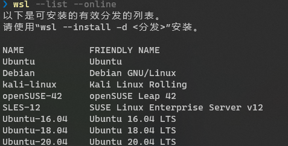
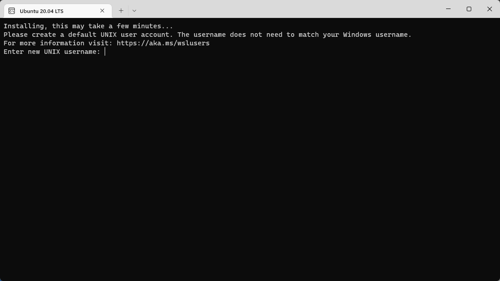
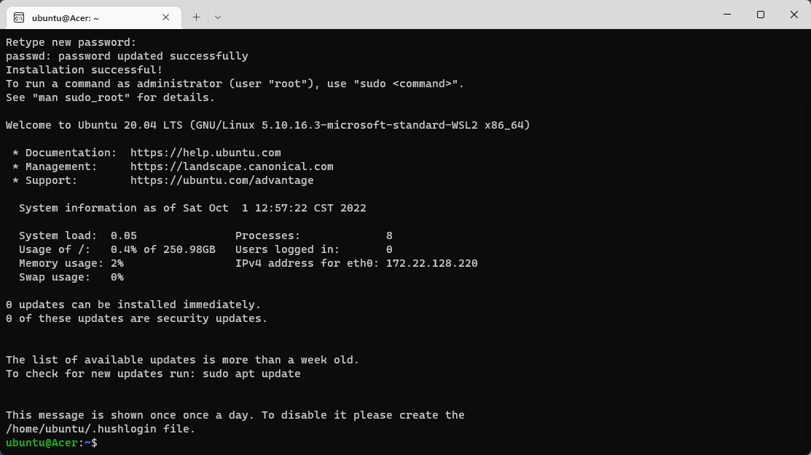
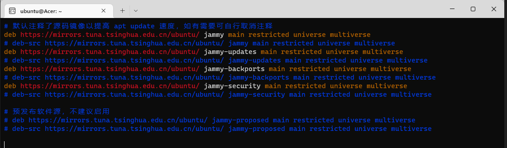
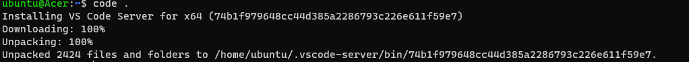
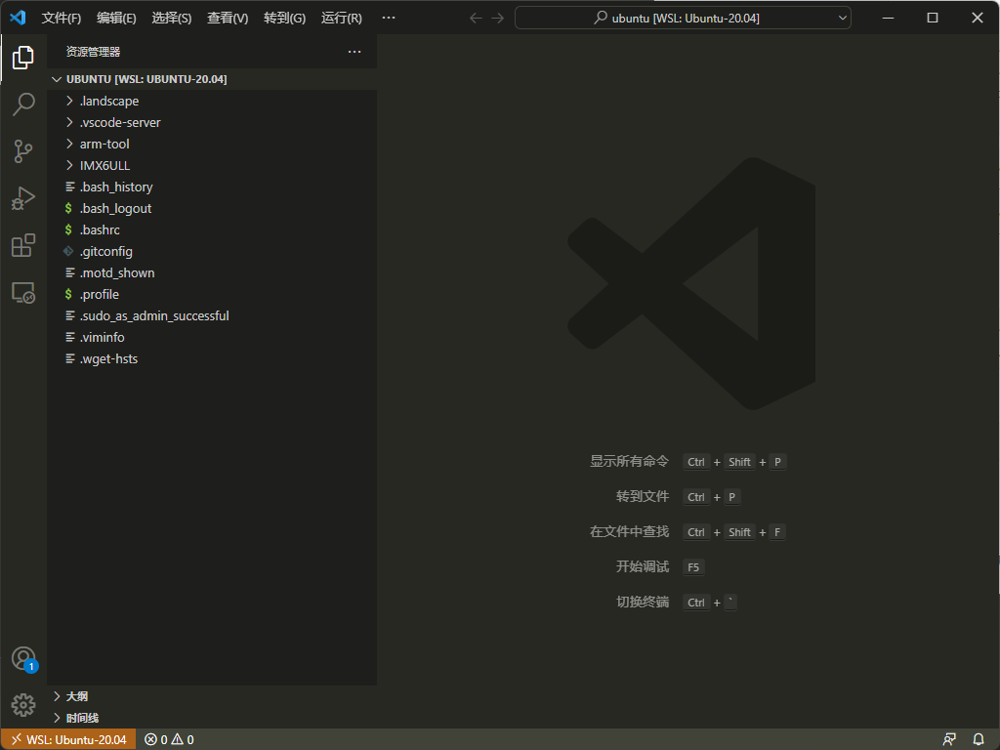

# window安装WSL

wsl 暂不支持NFS，所以目前还不好用，其他用起来都挺不错。

## 1 安装

1. 微软官方安装教程([安装 WSL | Microsoft Learn](https://learn.microsoft.com/zh-cn/windows/wsl/install))

- 查看可以安装的版本：

   ```powershell
   wsl --list --online
   ```



- 安装喜欢的版本：

   ```powershell
   wsl --install -d Ubuntu-20.04
   ```


- 等带安装成功之后，创建一个新的用户名和密码，就可以愉快的玩耍了





## 2 环境部署

1. 更换软件源

   为了提过软件下载速度可以使用国内镜像源（阿里、网易、教育网……），这里使用的是清华大学的镜像源[ubuntu | 镜像站使用帮助 | 清华大学开源软件镜像站 | Tsinghua Open Source Mirror](https://mirrors.tuna.tsinghua.edu.cn/help/ubuntu/)。

   ```bash
   sudo vim /etc/apt/sources.list
   ```

   ```bash
   # 默认注释了源码镜像以提高 apt update 速度，如有需要可自行取消注释
   deb https://mirrors.tuna.tsinghua.edu.cn/ubuntu/ jammy main restricted universe multiverse
   # deb-src https://mirrors.tuna.tsinghua.edu.cn/ubuntu/ jammy main restricted universe multiverse
   deb https://mirrors.tuna.tsinghua.edu.cn/ubuntu/ jammy-updates main restricted universe multiverse
   # deb-src https://mirrors.tuna.tsinghua.edu.cn/ubuntu/ jammy-updates main restricted universe multiverse
   deb https://mirrors.tuna.tsinghua.edu.cn/ubuntu/ jammy-backports main restricted universe multiverse
   # deb-src https://mirrors.tuna.tsinghua.edu.cn/ubuntu/ jammy-backports main restricted universe multiverse
   deb https://mirrors.tuna.tsinghua.edu.cn/ubuntu/ jammy-security main restricted universe multiverse
   # deb-src https://mirrors.tuna.tsinghua.edu.cn/ubuntu/ jammy-security main restricted universe multiverse
   
   # 预发布软件源，不建议启用
   # deb https://mirrors.tuna.tsinghua.edu.cn/ubuntu/ jammy-proposed main restricted universe multiverse
   # deb-src https://mirrors.tuna.tsinghua.edu.cn/ubuntu/ jammy-proposed main restricted universe multiverse
   ```


- 添加效果如下：



- 接下来更新更新一下

   ```bash
   sudo apt-get update
   sudo apt-get upgrade
   ```

2. 在终端输入`code .`直接通过windows的VS code打开当前文件夹

   

   >  windows桌面直接打开vs code ，前提是vscode需要安装remote-ssh

   

3. 安装交叉编译工具链

   交叉编译工具链可以有以下选择：

   arm官网：[Downloads | GNU-A Downloads – Arm Developer](https://developer.arm.com/downloads/-/gnu-a) 

   Linaro:[Accelerating deployment of Arm-based solutions | Linaro](https://www.linaro.org/)

   ```bash
   mkdir arm-tool
   cd arm-tool/
   ```

   ```bash
   wget https://armkeil.blob.core.windows.net/developer/Files/downloads/gnu/11.2-2022.02/binrel/gcc-arm-11.2-2022.02-x86_64-arm-none-linux-gnueabihf.tar.xz
   ```

   ```bash
   xz -d gcc-arm-11.2-2022.02-x86_64-arm-none-linux-gnueabihf.tar.xz
   tar xf gcc-arm-11.2-2022.02-x86_64-arm-none-linux-gnueabihf.tar 
   ```

4. 配置环境变量

   ```bash
   vim ~/.bashrc
   ```

   ```bash
   export CROSS_COMPILE=/home/ubuntu/arm-tool/gcc-arm-11.2-2022.02-x86_64-arm-none-linux-gnueabihf/bin/arm-none-linux-gnueabihf-
   export ARCH=arm
   ```

   ```bash
   source ~/.bashrc 
   ```

5. 如果WSL中想使用USB端口可以进行以下操作

   微软教程[连接 USB 设备 | Microsoft Learn](https://learn.microsoft.com/zh-cn/windows/wsl/connect-usb)

   - 在windows终端输入：

      ```powershell
      winget install usbipd
      ```
   
   - 安装完成后windows powershell 管理员身份
   
     ```powershell
     usbipd list
     ```
   
   - 接下来在 WSL终端
   
      ```bash
      sudo apt install linux-tools-5.4.0-77-generic hwdata
      sudo update-alternatives --install /usr/local/bin/usbip usbip /usr/lib/linux-tools/5.4.0-77-generic/usbip 20
      ```
   
   - 现在就可以在windows终端输入以下，来查看usb设备

      ```powershell
      usbipd wsl list
      ```
   
   - 在windows终端输入以下来，
   
      ```powershell
      usbipd wsl attach --busid <busid>
      ```
   
   - 现在就可以在WSL中看到USB设备了

      ```bash
      lsusb
      ```

   - 如果想将USB设备切换回windows，可以用以下命令

      ```powershell
      usbipd wsl detach --busid <busid>
      ```

   