# IMX6ULL基于官方源码移植（NAND）

[TOC]


## 1 前言

开发环境:

| ---                     | ---                       |
| ----------------------- | :------------------------ |
| 工作主机                | Windows                   |
| Linux开发主机           | WSL2（ubuntu）            |
| 开发板                  | 米尔电子IMX6ULL -IOT      |
| 代码编辑器              | VS Code                   |
| 串口终端                | MobaXterm                 |
| 远程终端(访问Linux主机) | VS Code remote-ssh        |
| 交叉编译工具链          | arm-none-linux-gnueabihf- |

## 2 U-boot（2022.04-dirty）

### 2.1 源码编译

1. 获取源码

   ```bash
   mkdir IMX6ULL
   cd IMX6ULL
   git clone https://source.codeaurora.org/external/imx/uboot-imx
   cd uboot-imx
   git checkout lf-5.15.32-2.0.0   // 切换至想要的分支
   git checkout -b lf-5.15.32-2.0.0
   ```
   
2. 设置环境变量

   ```bash
   export CROSS_COMPILE=/home/ubuntu/arm-tool/gcc-arm-11.2-2022.02-x86_64-arm-none-linux-gnueabihf/bin/arm-none-linux-gnueabihf-
   export ARCH=arm
   export PATH=$PATH:/home/ubuntu/arm-tool/gcc-arm-11.2-2022.02-x86_64-arm-none-linux-gnue
   abihf/bin/
   
   echo $ARCH
   ```
   
   
   
3. 初始化配置

   ```bash
   make distclean
   make mx6ull_14x14_evk_nand_defconfig
   make menuconfig /* 图形化配置 */
   ```
   
4. 生成

   ```bash
   make -jN
   ```
   
   生成以下文件
   
   > u-boot-dtb.imx
   
   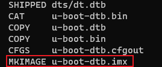
   
   ```
    .\uuu.exe -b nand .\u-boot-dtb.imx
   ```
   
   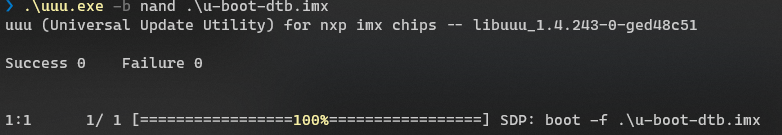

   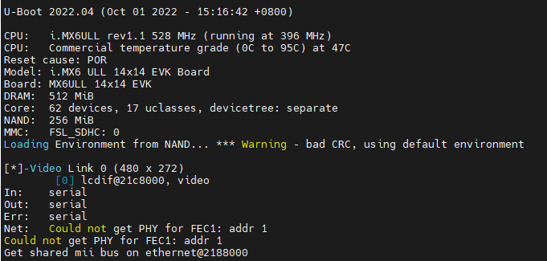
   
   
### 2.2 u-boot porting

1. copy **configs/mx6ull_14x14_evk_nand_defconfig** and rename

   ```bash
   cp ./configs/mx6ull_14x14_evk_nand_defconfig ./configs/my_mx6ull_14x14_evk_nand_defconfig
   
   vim ./configs/my_mx6ull_14x14_evk_nand_defconfig
   
   code ./configs/my_mx6ull_14x14_evk_nand_defconfig
   ```
   
   修改：
   
   > ~~CONFIG_TARGET_MX6ULL_14X14_EVK=y~~
   >
   > CONFIG_TARGET_MY_MX6ULL_14X14_EVK=y
   
2. copy **include/configs/mx6ullevk.h** and rename

   ```bash
   cp include/configs/mx6ullevk.h include/configs/mymx6ullevk.h
   ```
   
3. copy **board/freescale/mx6ullevk/**and rename

   ```bash
   cp board/freescale/mx6ullevk/ board/freescale/mymx6ullevk -r
   ```
   
4. rename **board/freescale/mymx6ullevk/mx6ullevk.c**

   ```bash
   mv board/freescale/mymx6ullevk/mx6ullevk.c board/freescale/mymx6ullevk/mymx6ullevk.c
   ```
   
5. edit **board/freescale/mymx6ullevk/Makefile**

   ```bash
    vim board/freescale/mymx6ullevk/Makefile
    code board/freescale/mymx6ullevk/Makefile
   ```
   
   修改以下：
   
   > ~~obj-y  := mx6ullevk.o~~
   >
   > obj-y  := mymx6ullevk.o
   
6. edit **board/freescale/mymx6ullevk/imximage.cfg**

   ```bash
   vim board/freescale/mymx6ullevk/imximage.cfg
   code board/freescale/mymx6ullevk/imximage.cfg
   ```
   修改以下：
   
   > ~~PLUGIN  board/freescale/mx6ullevk/plugin.bin 0x00907000~~
   >
   > PLUGIN  board/freescale/mymx6ullevk/plugin.bin 0x00907000
   
7. edit **board/freescale/mymx6ullevk/Kconfig**

   ```bash
   vim board/freescale/mymx6ullevk/Kconfig
   code board/freescale/mymx6ullevk/Kconfig
   ```
   修改以下：
   
   > ~~if TARGET_MX6ULL_14X14_EVK || TARGET_MX6ULL_9X9_EVK~~
   >
   > config SYS_BOARD
   > 	~~default "mx6ullevk"~~
   >
   > config SYS_VENDOR
   > 	default "freescale"
   >
   > config SYS_CONFIG_NAME
   > 	~~default "mx6ullevk"~~
   >
   > config IMX_CONFIG
   > 	default "board/freescale/~~mx6ullevk~~/imximage.cfg"
   >
   > config SYS_TEXT_BASE
   > 	default 0x87800000
   > endif
   >
   > 
   >
   > if TARGET_MY_MX6ULL_14X14_EVK
   >
   > config SYS_BOARD
   > 	default "mymx6ullevk"
   >
   > config SYS_VENDOR
   > 	default "freescale"
   >
   > config SYS_CONFIG_NAME
   > 	default "mymx6ullevk"
   >
   > config IMX_CONFIG
   > 	default "board/freescale/mymx6ullevk/imximage.cfg"
   >
   > config SYS_TEXT_BASE
   > 	default 0x87800000
   > endif
   
8. edit **board/freescale/mymx6ullevk/MAINTAINERS**

   ```bash
   vim board/freescale/mymx6ullevk/MAINTAINERS
   code board/freescale/mymx6ullevk/MAINTAINERS
   ```
   修改以下：
   
   > MX6ULLEVK BOARD
   > M:	Peng Fan <peng.fan@nxp.com>
   > S:	Maintained
   > F:	board/freescale/mx6ullevk/
   > F:	include/configs/mx6ullevk.h
   > F:	configs/mx6ull_14x14_evk_defconfig
   > F:	configs/mx6ull_14x14_evk_plugin_defconfig
   > F:	configs/mx6ulz_14x14_evk_defconfig
   >
   > 
   >
   > MX6ULLEVK BOARD
   > M:	Peng Fan <peng.fan@nxp.com>
   > S:	Maintained
   > F:	board/freescale/mymx6ullevk/
   > F:	include/configs/mymx6ullevk.h
   > F:	configs/my_mx6ull_14x14_evk_defconfig
   
9. edit **arch/arm/mach-imx/mx6/Kconfig**

   ```bash
   vim arch/arm/mach-imx/mx6/Kconfig
   code arch/arm/mach-imx/mx6/Kconfig
   
   ```
   添加以下：
   >config TARGET_MX6ULL_14X14_EVK
   >	bool "Support mx6ull_14x14_evk"
   >	depends on MX6ULL
   >	select BOARD_LATE_INIT
   >	select DM
   >	select DM_THERMAL
   >	select IMX_MODULE_FUSE
   >	select OF_SYSTEM_SETUP
   >	imply CMD_DM
   >
   >
   >
   >config TARGET_MY_MX6ULL_14X14_EVK
   >	bool "Support mymx6ull_14x14_evk"
   >	depends on MX6ULL
   >	select BOARD_LATE_INIT
   >	select DM
   >	select DM_THERMAL
   >	imply CMD_DM
   >
   >
   >
   >source "board/freescale/mx6ullevk/Kconfig"
   >
   >
   >
   >source "board/freescale/mymx6ullevk/Kconfig"
   
   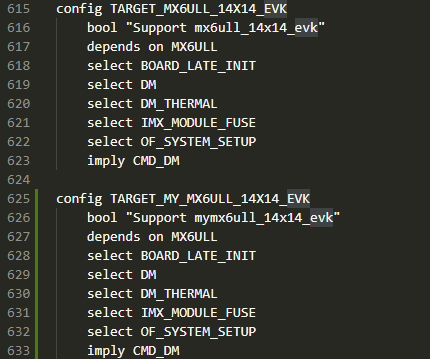
   
   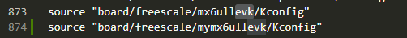
   
   
   
   ```bash
   export CROSS_COMPILE=/home/ubuntu/arm-tool/gcc-arm-11.2-2022.02-x86_64-arm-none-linux-gnueabihf/bin/arm-none-linux-gnueabihf-
   export ARCH=arm
   ```
   
   
   
   ```bash
   make distclean
   ```
   
   ```bash
   make my_mx6ull_14x14_evk_nand_defconfig
   ```
   
   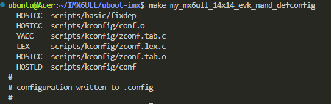
   
   ```bash
   make -jN
   ```
   
   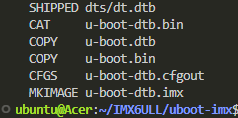
   
   ```
   .\uuu.exe -b nand .\u-boot-dtb.imx
   ```
   
   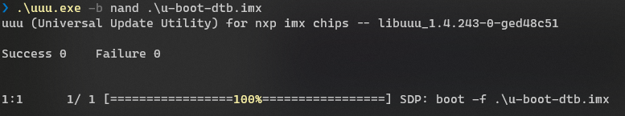
   
   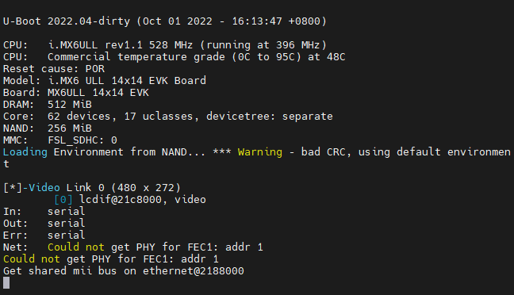
   
   
   
### 2.3 DeviceTree porting

#### 2.3.1 LCD

1. 查看开发板LCD原理图

   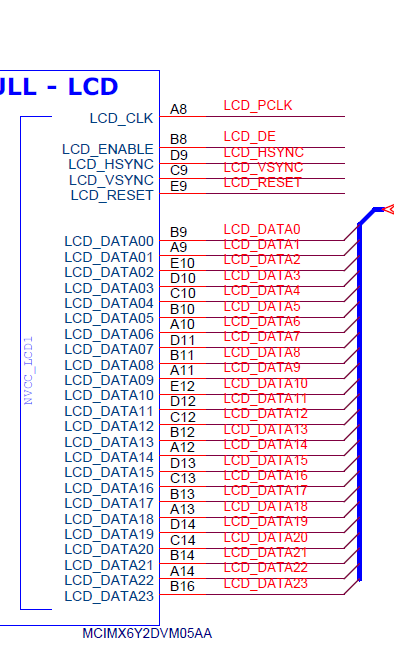
   
   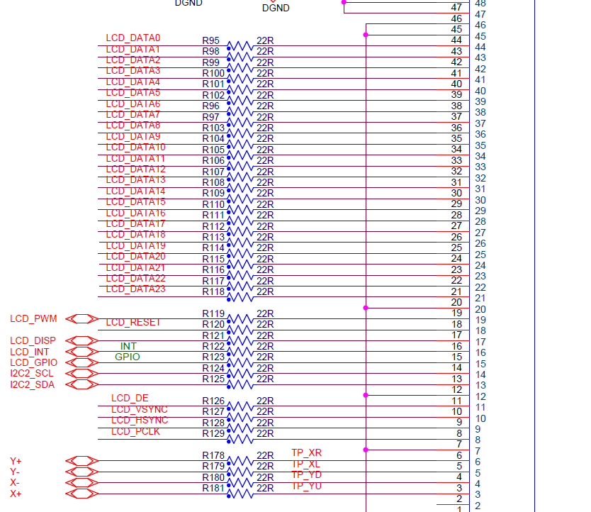

2. 备份原设备树文件

   ```bash
   cp arch/arm/dts/imx6ull-14x14-evk-gpmi-weim.dts   arch/arm/dts/myimx6ull-14x14-evk-gpmi-weim.dts
   
   vim code arch/arm/dts/myimx6ull-14x14-evk-gpmi-weim.dts
   code arch/arm/dts/myimx6ull-14x14-evk-gpmi-weim.dts
   
   ```

3. 根据原理图添加LCD配置

   ```
   &lcdif {
   	pinctrl-names = "default";
   	pinctrl-0 = <&pinctrl_lcdif_dat
   		     &pinctrl_lcdif_ctrl>;
   
   	display = <&display0>;
   	status = "okay";
   
   	display0: display@0 {
   		bits-per-pixel = <24>;
   		bus-width = <24>;
   
   		display-timings {
   			native-mode = <&timing0>;
   			
   			timing0: timing0 {
   				clock-frequency = <50000000>;
   				hactive = <1024>;
   				vactive = <600>;
   				hfront-porch = <160>;
   				hback-porch = <140>;
   				hsync-len = <20>;
   				vback-porch = <20>;
   				vfront-porch = <12>;
   				vsync-len = <3>;
   
   				hsync-active = <0>;
   				vsync-active = <0>;
   				de-active = <1>;
   				pixelclk-active = <0>;
   			};
   		};
   	};
   };
   
   &iomuxc {
   	pinctrl-names = "default";
       pinctrl_lcdif_dat: lcdifdatgrp {
   		fsl,pins = <
   			MX6UL_PAD_LCD_DATA00__LCDIF_DATA00  0x79
   			MX6UL_PAD_LCD_DATA01__LCDIF_DATA01  0x79
   			MX6UL_PAD_LCD_DATA02__LCDIF_DATA02  0x79
   			MX6UL_PAD_LCD_DATA03__LCDIF_DATA03  0x79
   			MX6UL_PAD_LCD_DATA04__LCDIF_DATA04  0x79
   			MX6UL_PAD_LCD_DATA05__LCDIF_DATA05  0x79
   			MX6UL_PAD_LCD_DATA06__LCDIF_DATA06  0x79
   			MX6UL_PAD_LCD_DATA07__LCDIF_DATA07  0x79
   			MX6UL_PAD_LCD_DATA08__LCDIF_DATA08  0x79
   			MX6UL_PAD_LCD_DATA09__LCDIF_DATA09  0x79
   			MX6UL_PAD_LCD_DATA10__LCDIF_DATA10  0x79
   			MX6UL_PAD_LCD_DATA11__LCDIF_DATA11  0x79
   			MX6UL_PAD_LCD_DATA12__LCDIF_DATA12  0x79
   			MX6UL_PAD_LCD_DATA13__LCDIF_DATA13  0x79
   			MX6UL_PAD_LCD_DATA14__LCDIF_DATA14  0x79
   			MX6UL_PAD_LCD_DATA15__LCDIF_DATA15  0x79
   			MX6UL_PAD_LCD_DATA16__LCDIF_DATA16  0x79
   			MX6UL_PAD_LCD_DATA17__LCDIF_DATA17  0x79
   			MX6UL_PAD_LCD_DATA18__LCDIF_DATA18  0x79
   			MX6UL_PAD_LCD_DATA19__LCDIF_DATA19  0x79
   			MX6UL_PAD_LCD_DATA20__LCDIF_DATA20  0x79
   			MX6UL_PAD_LCD_DATA21__LCDIF_DATA21  0x79
   			MX6UL_PAD_LCD_DATA22__LCDIF_DATA22  0x79
   			MX6UL_PAD_LCD_DATA23__LCDIF_DATA23  0x79
   		>;
   	};
   
   	pinctrl_lcdif_ctrl: lcdifctrlgrp {
   		fsl,pins = <
   			MX6UL_PAD_LCD_CLK__LCDIF_CLK	    0x79
   			MX6UL_PAD_LCD_ENABLE__LCDIF_ENABLE  0x79
   			MX6UL_PAD_LCD_HSYNC__LCDIF_HSYNC    0x79
   			MX6UL_PAD_LCD_VSYNC__LCDIF_VSYNC    0x79
   			/* used for lcd reset */
   			MX6UL_PAD_SNVS_TAMPER9__GPIO5_IO09  0x79
   		>;
   	};
   };
   
   ```

4. 修改**/configs/my_mx6ull_14x14_evk_nand_defconfig**

   ```bash
   vim ./configs/my_mx6ull_14x14_evk_nand_defconfig
   code ./configs/my_mx6ull_14x14_evk_nand_defconfig
   ```

   修改以下

   > ~~CONFIG_DEFAULT_DEVICE_TREE="imx6ull-14x14-evk-gpmi-weim"~~
   >
   > 
   >
   > CONFIG_DEFAULT_DEVICE_TREE="myimx6ull-14x14-evk-gpmi-weim"

5. 重新编译下载

   ```bash
   export CROSS_COMPILE=/home/ubuntu/arm-tool/gcc-arm-11.2-2022.02-x86_64-arm-none-linux-gnueabihf/bin/arm-none-linux-gnueabihf-
   export ARCH=arm
   
   make distclean
   make my_mx6ull_14x14_evk_nand_defconfig
   make -jN (N编译处理器个数)
   ```
   
   
   
   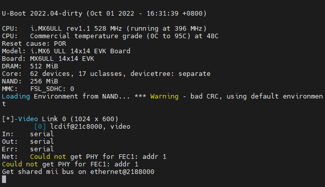

#### 2.3.2 Ethernet

1. 查看开发板网口原理图

   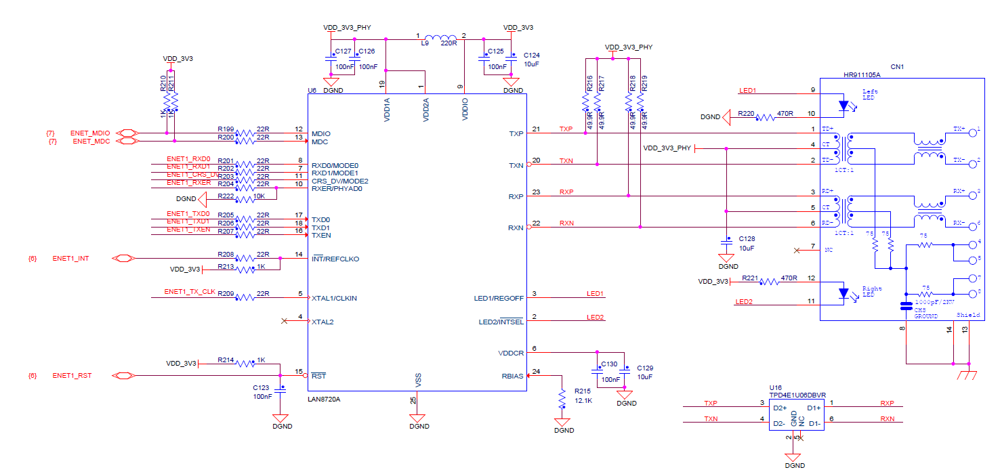

   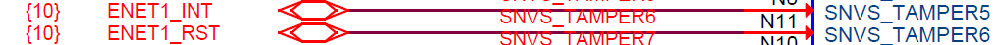

   

  

2. 根据原理图添加网口配置

   ```
   &fec1 {
   	pinctrl-names = "default";
   	pinctrl-0 = <&pinctrl_enet1>;
   	phy-mode = "rmii";
   	phy-handle = <&ethphy>;
   	local-mac-address = [00 04 9F 01 1B B9];
   	phy-reset-gpios = <&gpio5 6 GPIO_ACTIVE_LOW>;
   	phy-reset-duration = <50>;
   	phy-reset-post-delay = <15>;
   	status = "okay";
   
   	mdio {
   		#address-cells = <1>;
   		#size-cells = <0>;
   
   		ethphy: ethernet-phy@0 {
   			//compatible = "ethernet-phy-ieee802.3-c22";
   			reg = <0>;
   			interrupt-parent = <&gpio5>;
   			interrupts = <5 8>;
   			max-speed = <100>;
   
   			micrel,led-mode = <1>;
   			clocks = <&clks IMX6UL_CLK_ENET_REF>;
   			clock-names = "rmii-ref";
   		};
   	};
   };
   
   &fec2 {
   	status = "disable";
   };
   
   &iomuxc {
   	pinctrl-names = "default";
   
   	pinctrl_enet1: enet1grp {
   		fsl,pins = <
   			MX6UL_PAD_GPIO1_IO07__ENET1_MDC		0x1b0b0
   			MX6UL_PAD_GPIO1_IO06__ENET1_MDIO	0x1b0b0
   			MX6UL_PAD_ENET1_RX_EN__ENET1_RX_EN	0x1b0b0
   			MX6UL_PAD_ENET1_RX_ER__ENET1_RX_ER	0x1b0b0
   			MX6UL_PAD_ENET1_RX_DATA0__ENET1_RDATA00	0x1b0b0
   			MX6UL_PAD_ENET1_RX_DATA1__ENET1_RDATA01	0x1b0b0
   			MX6UL_PAD_ENET1_TX_EN__ENET1_TX_EN	0x1b0b0
   			MX6UL_PAD_ENET1_TX_DATA0__ENET1_TDATA00	0x1b0b0
   			MX6UL_PAD_ENET1_TX_DATA1__ENET1_TDATA01	0x1b0b0
   			MX6UL_PAD_ENET1_TX_CLK__ENET1_REF_CLK1	0x4001b031
   			MX6UL_PAD_SNVS_TAMPER5__GPIO5_IO05  0xb0b0
   			MX6UL_PAD_SNVS_TAMPER6__GPIO5_IO06  0xb0b0
   		>;
   	};
   };
   ```

   

3. 编译下载运行

   ```bash
   export CROSS_COMPILE=/home/ubuntu/arm-tool/gcc-arm-11.2-2022.02-x86_64-arm-none-linux-gnueabihf/bin/arm-none-linux-gnueabihf-
   export ARCH=arm
   
   make distclean
   make my_mx6ull_14x14_evk_nand_defconfig
   make -jN (N编译处理器个数)
   ```

   

4. 开机

   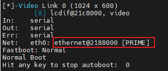

   ```bash
   setenv ipaddr 192.168.3.112
   ping 192.168.3.18
   ```

   不能ping通

5. 修改配置文件

   ```bash
   vim ./configs/my_mx6ull_14x14_evk_nand_defconfig
   code ./configs/my_mx6ull_14x14_evk_nand_defconfig
   ```

   > ~~CONFIG_PHY_MICREL=y~~
   >
   > ~~CONFIG_PHY_MICREL_KSZ8XXX=y~~
   >
   > CONFIG_PHY_SMSC=y

   依旧不能ping通

6. 修改以下（百度结果）

   > 
   > ```bash
   > int genphy_config_aneg(*struct* phy_device **phydev*)
   >
   > {
   >
   > *int* result;
   >
   > phy_reset(*phydev*);
   > ```

   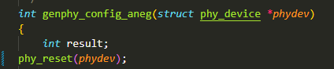

   ping通

   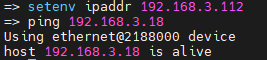


---


## 添加LCD Termux

   /etc/inittab

   ```
tty1::askfirst:-/bin/sh
   ```

   ```
setenv bootargs 'console=tty1 console=ttymxc0,115200 ubi.mtd=4 root=ubi0:rootfs rootfstype=ubifs mem=256m mtdparts=gpmi-nand:5m(nandboot),1m(env),8m(nandkernel),2m(nanddtb),180m(nandrootfs),-(userdate)'
   ```

## 修改开机LOGO

   /tool/Makefile

   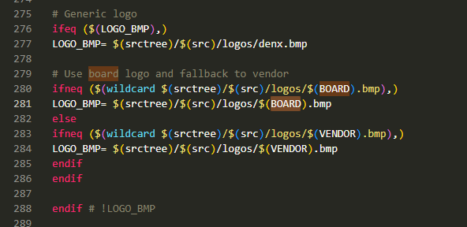

   common/lcd.c **bitmap_plot**   logo位置

   splash.bmp

## uuu 下载程序

   ```
.\uuu.exe -b nand .\u-boot-dtb.imx
   ```

## VS Code 配置

### 1 setting.json 隐藏文件

   ```
   {
       "files.exclude": {
           "**/.git": true,
           "**/.svn": true,
           "**/.hg": true,
           "**/CVS": true,
           "**/.DS_Store": true,
           "**/Thumbs.db": true,
           ".vscode/": false,
           "**/arm/mach-imx/imx*": true,
           "**/arm/mach-imx/mx3": true,
           "**/arm/mach-imx/mx5": true,
           "**/arm/mach-imx/mx7*": true,
           "**/arm/mach-imx/mxs": true,
       }
   }
   ```


### 2 task.json 一键拷贝加make

```
{
	"version": "2.0.0",
	"tasks": [
		{
			"type": "shell",
			"label": "拷贝",
			"command": "cp",
			"args": [
				"${workspaceFolder}/u-boot-dtb.imx",
				"/mnt/e/Users/Acer/Desktop/烧写工具/uuu"
			],
			"options": {
				"cwd": "${fileDirname}"
			},
			"problemMatcher": [
				"$gcc"
			],
			"group": {
				"kind": "build",
				"isDefault": true
			},
			"dependsOn": [
				"make"
			]
		},
		{
			"type": "shell",
			"label": "make",
			"command": "make",
			"args": [
				"-j4",
				"CROSS_COMPILE=/home/ubuntu/arm-tool/gcc-arm-11.2-2022.02-x86_64-arm-none-linux-gnueabihf/bin/arm-none-linux-gnueabihf-",
				"ARCH=arm"
			],
			"options": {
				"cwd": "${workspaceFolder}"
			},
			"problemMatcher": [
				"$gcc"
			],
			"group": "build",
			"detail": ""
		}
	]

}
```


