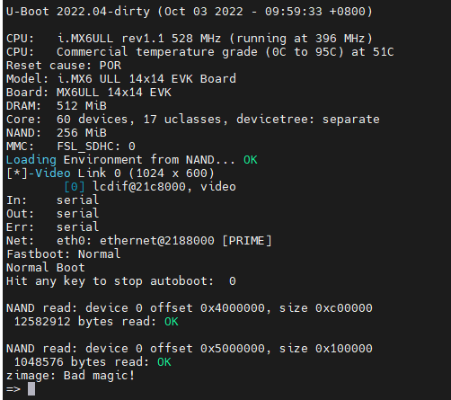
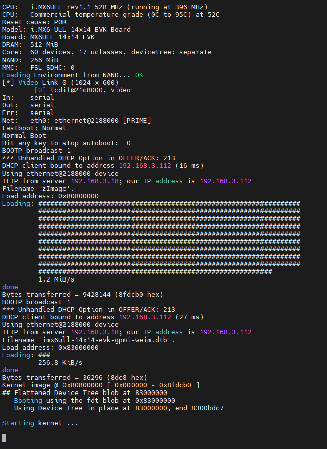
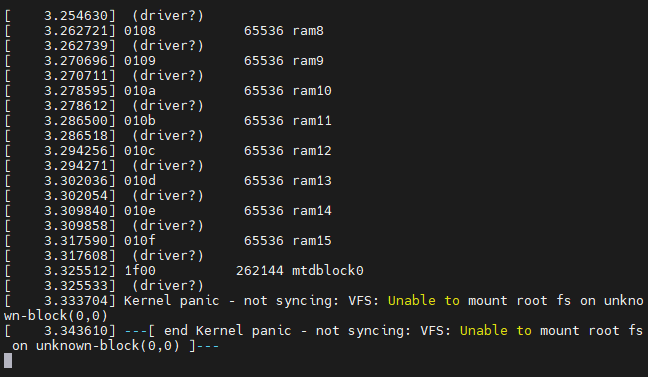
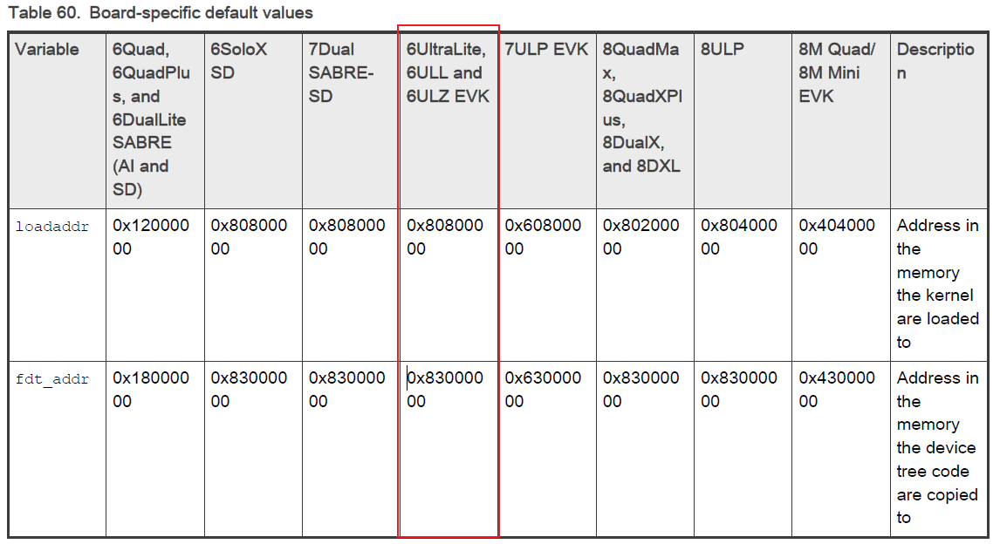

## 1 前言

开发环境:

| ---                     | ---                       |
| ----------------------- | :------------------------ |
| 工作主机                | Windows                   |
| Linux开发主机           | WSL2（ubuntu）            |
| 开发板                  | 米尔电子IMX6ULL -IOT      |
| 代码编辑器              | VS Code                   |
| 串口终端                | MobaXterm                 |
| 远程终端(访问Linux主机) | VS Code remote-ssh        |
| 交叉编译工具链          | arm-none-linux-gnueabihf- |

## 3 Linux Kennal（5.15.32）

### 3.1 源码编译

1. 获取源码

   ```bash
   cd IMX6ULL
   git clone https://source.codeaurora.org/external/imx/linux-imx
   cd linux-imx
   git checkout lf-5.15.32-2.0.0   // 切换至想要的分支
   git checkout -b lf-5.15.32-2.0.0
   ```
   
2. 设置环境变量

   ```bash
   export CROSS_COMPILE=/home/ubuntu/arm-tool/gcc-arm-11.2-2022.02-x86_64-arm-none-linux-gnueabihf/bin/arm-none-linux-gnueabihf-
   export ARCH=arm
   ```
   
3. 初始化配置

   ```bash
   make distclean
   make imx_v7_defconfig
   make menuconfig /* 图形化配置 */
   ```
   
4. 生成

   ```bash
   make -jN
   ```
   
   生成以下文件
   
   > arch/arm/boot/zImage
   > arch/arm/boot/dts/imx6ull-14x14-evk-gpmi-weim.dtb
   
### 3.2 加载内核



#### 3.2.1 SD卡、NAND FLASH、EMMC


#### 3.2.2 NFS

1. 复制生成的文件至tftp共享目录

   > arch/arm/boot/zImage
   > arch/arm/boot/dts/imx6ull-14x14-evk-gpmi-weim.dtb

2. 进入u-boot设置环境变量

   a. 自动加载

   ```bash
   setenv ipaddr 192.168.3.112
   setenv serverip 192.168.3.18
   setenv image zImage
   setenv fdtfile imx6ull-14x14-evk-gpmi-weim.dtb
   
   setenv bootcmd_net 'dhcp ${image}; dhcp ${fdt_addr} ${fdtfile}; bootz ${loadaddr} - ${fdt_addr}'
   
   setenv bootcmd 'run bootcmd_net'
   
   // 未知
   setenv bootargs 'mem=256m'
   saveenv
   reset
   ```

   

   

   b. 手动加载

   ```
   setenv ipaddr 192.168.3.112
   ping 192.168.3.18
   
   setenv serverip 192.168.3.18
   tftp 80800000 zImage
   tftp 83000000 imx6ull-14x14-evk-gpmi-weim.dtb
   bootz 80800000 - 83000000
   ```

   

> 重置u-boot环境变量
>
> ```bash
> env default -a
> ```

### kennal启动异常

   ```
mtdparts=[memory type designator]:[size]([name of partition]),[size]([name of partition]),-([name of final partition])
      
setenv bootcmd 'run bootargsset; {settings-for-device}; bootz ${loadaddr} - ${fdt_addr}'
setenv bootcmd 'run bootargsset; nand read ${loadaddr} 0x1000000 0x800000; nand read ${fdt_addr} 0x2000000 0x100000; bootz ${loadaddr} - ${fdt_addr}'
   ```

   nand

   ```bash
mtdparts=gpmi-nand:64m(boot),16m(kernel),16m(dtb),-(rootfs)
mtdparts=gpmi-nand:5m(nandboot),1m(env),8m(nandkernel),2m(nanddtb),180m(nandrootfs),-(userdate)
   ```

​      

   ```bash
setenv bootcmd 'run bootargsset; nand read ${loadaddr} 0x600000 0x800000; nand read ${fdt_addr} 0xe00000 0x200000; bootz ${loadaddr} - ${fdt_addr}'

setenv bootargs 'ttymxc0,115200 ubi.mtd=4 root=ubi0:rootfs rootfstype=ubifs mem=256m mtdparts=gpmi-nand:5m(nandboot),1m(env),8m(nandkernel),2m(nanddtb),180m(nandrootfs),-(userdate)'

saveenv

reset
   ```


​      

   ### 3.3内核移植

1. copy

   ```bash
   cp arch/arm/configs/imx_v7_defconfig arch/arm/configs/myimx_v7_defconfig
   ```

   ```bash
   cp arch/arm/boot/dts/imx6ull-14x14-evk-gpmi-weim.dts arch/arm/boot/dts/myimx6ull-14x14-evk-gpmi-weim.dts
   ```

   ```bash
   vim arch/arm/boot/dts/Makefile
   code arch/arm/boot/dts/Makefile
   ```
```
   
> myimx6ull-14x14-evk-gpmi-weim.dts \
   

   

   
   ```bash
   make myimx_v7_defconfig
   make menuconfig
make -jN
```

   ```
code arch/arm/boot/dts/myimx6ull-14x14-evk-gpmi-weim.dts
   ```

   ```
   
   &fec1 {
   	pinctrl-names = "default";
   	pinctrl-0 = <&pinctrl_enet1>;
   	phy-mode = "rmii";
   	phy-handle = <&ethphy>;
   	phy-reset-gpios = <&gpio5 6 GPIO_ACTIVE_LOW>;
   	phy-reset-duration = <50>;
   	phy-reset-post-delay = <15>;
   	//phy-supply = <&reg_peri_3v3>;
   	status = "okay";
   
   	mdio {
   		#address-cells = <1>;
   		#size-cells = <0>;
   
   		ethphy: ethernet-phy@0 {
   			compatible = "ethernet-phy-id0022.1560";
   			reg = <0>;
   			smsc,disable-energy-detect;
   			micrel,led-mode = <1>;
   			clocks = <&clks IMX6UL_CLK_ENET_REF>;
   			clock-names = "rmii-ref";
   
   		};
   	};
   };
   
   &fec2 {
   	status = "disable";
   };
   
   
   &lcdif {
   	assigned-clocks = <&clks IMX6UL_CLK_LCDIF_PRE_SEL>;
   	assigned-clock-parents = <&clks IMX6UL_CLK_PLL5_VIDEO_DIV>;
   	pinctrl-names = "default";
   	pinctrl-0 = <&pinctrl_lcdif_dat
   		     &pinctrl_lcdif_ctrl>;
   	display = <&display0>;
   	status = "okay";
   
   	display0: display@0 {
   		bits-per-pixel = <16>;
   		bus-width = <24>;
   
   		display-timings {
   			native-mode = <&timing0>;
   
   			timing0: timing0 {
   				clock-frequency = <9200000>;
   				hactive = <480>;
   				vactive = <272>;
   				hfront-porch = <8>;
   				hback-porch = <4>;
   				hsync-len = <41>;
   				vback-porch = <2>;
   				vfront-porch = <4>;
   				vsync-len = <10>;
   				hsync-active = <0>;
   				vsync-active = <0>;
   				de-active = <1>;
   				pixelclk-active = <0>;
   			};
   		};
   	};
   };
   
   &iomuxc {
   	pinctrl-names = "default";
   
   	pinctrl_enet1: enet1grp {
   		fsl,pins = <
   			MX6UL_PAD_GPIO1_IO07__ENET1_MDC		0x1b0b0
   			MX6UL_PAD_GPIO1_IO06__ENET1_MDIO	0x1b0b0
   			MX6UL_PAD_ENET1_RX_EN__ENET1_RX_EN	0x1b0b0
   			MX6UL_PAD_ENET1_RX_ER__ENET1_RX_ER	0x1b0b0
   			MX6UL_PAD_ENET1_RX_DATA0__ENET1_RDATA00	0x1b0b0
   			MX6UL_PAD_ENET1_RX_DATA1__ENET1_RDATA01	0x1b0b0
   			MX6UL_PAD_ENET1_TX_EN__ENET1_TX_EN	0x1b0b0
   			MX6UL_PAD_ENET1_TX_DATA0__ENET1_TDATA00	0x1b0b0
   			MX6UL_PAD_ENET1_TX_DATA1__ENET1_TDATA01	0x1b0b0
   			MX6UL_PAD_ENET1_TX_CLK__ENET1_REF_CLK1	0x4001b031
   			MX6UL_PAD_SNVS_TAMPER5__GPIO5_IO05  0xb0b0
   			MX6UL_PAD_SNVS_TAMPER6__GPIO5_IO06  0xb0b0
   		>;
   	};
   };

   ```

   