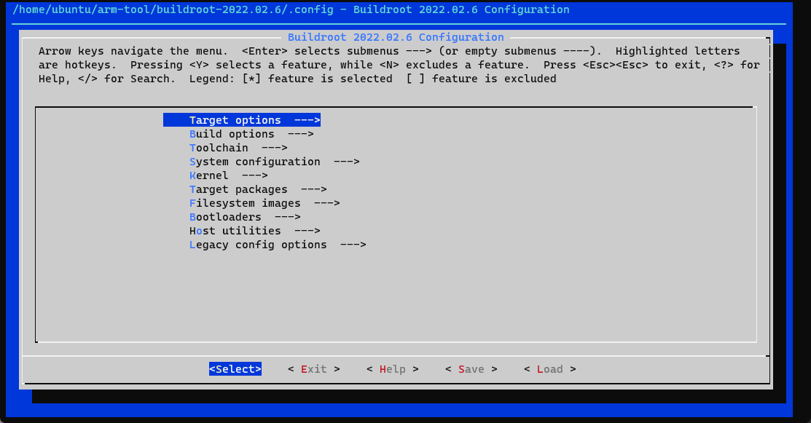
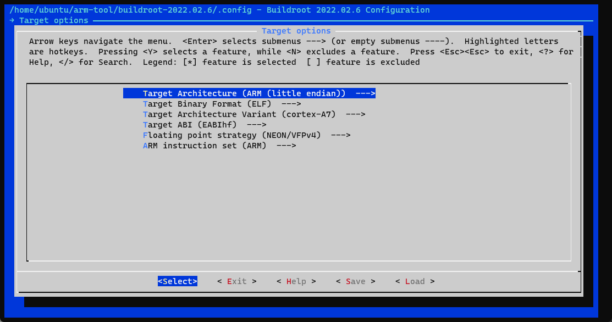
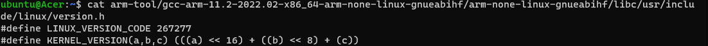
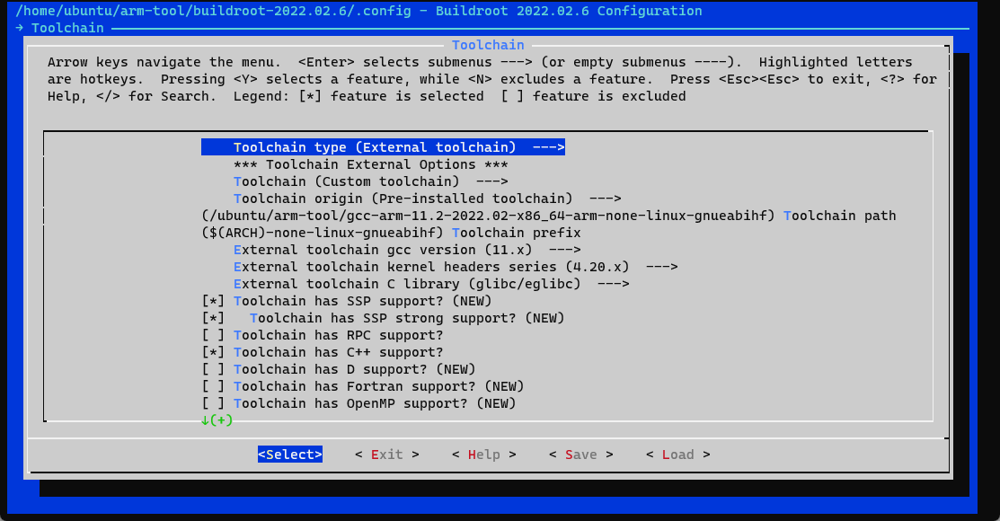
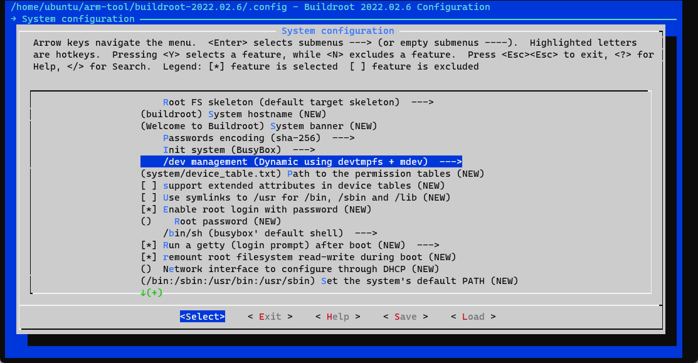

## 1 前言

开发环境:

| ---                     | ---                       |
| ----------------------- | :------------------------ |
| 工作主机                | Windows                   |
| Linux开发主机           | WSL2（ubuntu）            |
| 开发板                  | 米尔电子IMX6ULL -IOT      |
| 代码编辑器              | VS Code                   |
| 串口终端                | MobaXterm                 |
| 远程终端(访问Linux主机) | VS Code remote-ssh        |
| 交叉编译工具链          | arm-none-linux-gnueabihf- |

## 4 根文件系统

### 4.1 构建根文件系统

#### 4.1.1 基于busybox

```bash
wget https://busybox.net/downloads/busybox-1.35.0.tar.bz2
```


#### 4.1.2 基于rootbuild

1. 下载

   ```bash
   wget https://buildroot.org/downloads/buildroot-2022.02.6.tar.xz
   
   xz -d buildroot-2022.02.6.tar.xz
   tar xf buildroot-2022.02.6.tar
   
   cd buildroot-2022.02.6/
   ```

   ```bash
   make menuconfig
   ```

   

   

   ```
   /home/ubuntu/arm-tool/gcc-arm-11.2-2022.02-x86_64-arm-none-linux-gnueabihf
   ```

   ```
   $(ARCH)-none-linux-gnueabihf
   ```

   

   ```bash
   cat arm-tool/gcc-arm-11.2-2022.02-x86_64-arm-none-linux-gnueabihf/arm-none-linux-gnueabihf/libc/usr/include/linux/version.h
   
   #define LINUX_VERSION_CODE 267277
   #define KERNEL_VERSION(a,b,c) (((a) << 16) + ((b) << 8) + (c))
   ```

   

   

   

   ```bash
   cp .config myconfig
   sudo make
   
   make myconfig
   
   
   sudo cp /home/ubuntu/arm-tool/buildroot-2022.02.6/output/images/rootfs.ubi /mnt/e/nfs/
   sudo cp /home/ubuntu/arm-tool/buildroot-2022.02.6/output/images/rootfs.tar /mnt/e/nfs/
   ```

   

#### 4.1.3 基于yacto


### 4.2 加载根文件系统

#### 4.2.1 SD卡、NAND Flash、EMMC


#### 4.2.2 NFS

```bash
setenv rootfsinfo 'setenv bootargs ${bootargs} root=/dev/nfs ip=dhcp nfsroot=${serverip}:/home/nfs_root/rootfs,v3,tcp'

setenv bootcmd_net 'run rootfsinfo; dhcp ${image}; dhcp ${fdt_addr} ${fdtfile}; bootz ${loadaddr} - ${fdt_addr}'


setenv bootargs 'console=tty1 console=ttymxc0,115200 root=/dev/nfs nfsroot=192.168.3.18: /e/nfs/roofts rw ip=192.168.3.112:192.168.3.18:192.168.3.1:255.255. 255.0::eth0:off'
```


