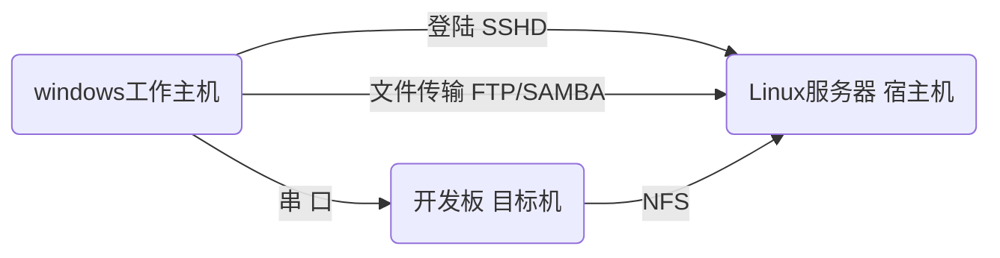

# 1 什么是嵌入式Linux

## 1.1 组成

# 开发模式

## 安装Linux主机

选择以下任意一种
- [安装Linux主机_VirtualBox](Linux笔记/00开发环境搭建与配置/安装Linux主机_VirtualBox/安装VirtualBox.md)

- [安装Linux主机_WSL](Linux笔记/00开发环境搭建与配置/安装Linux主机_WSL/WSL.md)

> WSL NFS挂载根文件系统存在问题

## 配置Linux主机开发环境

- [配置Linux主机开发环境](Linux笔记/00开发环境搭建与配置/配置Linux主机开发环境/配置Linux主机开发环境.md)

## Linux基本操作

- [常用命令](Linux笔记/01Linux基本操作/bash/常用命令.md)
- [vim](Linux笔记/01Linux基本操作/vim/vim.md)
- [gcc](Linux笔记/01Linux基本操作/gcc/gcc.md)
- [Makefile](Linux笔记/01Linux基本操作/Makefile/Makefile.md)

## 构建系统

- [基于开发板厂商系统构建](Linux笔记/02Linux系统构建/开发板厂商系统构建/开发板厂商系统构建.md)
- [基于官方EVK移植](Linux笔记/02Linux系统构建/基于官方EVK移植/README.md)

## 应用开发

## 驱动开发

## 过程问题记录

- [过程问题记录](Linux笔记/问题记录/问题记录.md ':include :type=code')
