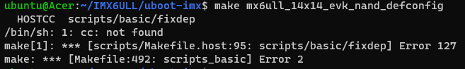

## 问题记录：

1. **问题：**

   make distclean  Command 'make' not found

   

   **解决方法：**

   ```bash
   sudo apt-get install make
   ```

   

2. **问题：**

   make mx6ull_14x14_evk_nand_defconfig  /bin/sh: 1: cc: not found

   ```bash
   ubuntu@Acer:~/IMX6ULL/uboot-imx$ make mx6ull_14x14_evk_nand_defconfig
   HOSTCC  scripts/basic/fixdep
   /bin/sh: 1: cc: not found
   make[1]: *** [scripts/Makefile.host:95: scripts/basic/fixdep] Error 127
   make: *** [Makefile:492: scripts_basic] Error 2
   ```

   

   **解决方法：**

   ```bash
   sudo apt-get install gcc -y
   ```

3. **问题：**

   make mx6ull_14x14_evk_nand_defconfig  /bin/sh: 1: bison: not found

   ```bash
   ubuntu@Acer:~/IMX6ULL/uboot-imx$ make mx6ull_14x14_evk_nand_defconfig
   HOSTCC  scripts/basic/fixdep
   HOSTCC  scripts/kconfig/conf.o
   YACC    scripts/kconfig/zconf.tab.c
   /bin/sh: 1: bison: not found
   make[1]: *** [scripts/Makefile.lib:224: scripts/kconfig/zconf.tab.c] Error 127
   make: *** [Makefile:574: mx6ull_14x14_evk_nand_defconfig] Error 2
   ```

   

   **解决方法：**

   ```bash
   sudo apt-get install bison -y
   ```

4. **问题：**

   make mx6ull_14x14_evk_nand_defconfig  /bin/sh: 1: flex: not found

   ```bash
   ubuntu@Acer:~/IMX6ULL/uboot-imx$ make mx6ull_14x14_evk_nand_defconfig
   YACC    scripts/kconfig/zconf.tab.c
   LEX     scripts/kconfig/zconf.lex.c
   /bin/sh: 1: flex: not found
   make[1]: *** [scripts/Makefile.lib:216: scripts/kconfig/zconf.lex.c] Error 127
   make: *** [Makefile:574: mx6ull_14x14_evk_nand_defconfig] Error 2
   ```

   

   **解决方法：**

   ```bash
   sudo apt-get install flex -y
   ```

   

5. **问题：**

   make include/image.h:1166:12: fatal error: openssl/evp.h: No such file or directory

   ```bash
   In file included from tools/imagetool.h:24,
                    from tools/aisimage.c:7:
   include/image.h:1166:12: fatal error: openssl/evp.h: No such file or directory
    1166 | #  include <openssl/evp.h>
         |            ^~~~~~~~~~~~~~~
   compilation terminated.
   make[1]: *** [scripts/Makefile.host:112: tools/aisimage.o] Error 1
   make[1]: *** Waiting for unfinished jobs....
     HOSTCC  tools/atmelimage.o
   In file included from tools/imagetool.h:24,
                    from tools/atmelimage.c:7:
   include/image.h:1166:12: fatal error: openssl/evp.h: No such file or directory
    1166 | #  include <openssl/evp.h>
         |            ^~~~~~~~~~~~~~~
   compilation terminated.
   make[1]: *** [scripts/Makefile.host:112: tools/atmelimage.o] Error 1
   make: *** [Makefile:1895: tools] Error 2
   ```

   

   **解决方法：**

   ```bash
   sudo apt-get install libssl-dev
   ```

6. **问题：**

   make menuconfig  Unable to find the ncurses package.

   ```bash
   ubuntu@Acer:~/IMX6ULL/uboot-imx$ make menuconfig
   *
   * Unable to find the ncurses package.
   * Install ncurses (ncurses-devel or libncurses-dev
   * depending on your distribution).
   *
   make[1]: *** [scripts/kconfig/Makefile:224: scripts/kconfig/.mconf-cfg] Error 1
   make: *** [Makefile:574: menuconfig] Error 2
   ```

   

   **解决方法：**

   ```bash
   sudo apt-get install libncurses-dev
   ```

   

7. **问题：**

   make /bin/sh: 1: lzop: not found

   ```bash
   /bin/sh: 1: lzop: not found
   make[2]: *** [arch/arm/boot/compressed/Makefile:185: arch/arm/boot/compressed/piggy_data] Error 127
   make[2]: *** Deleting file 'arch/arm/boot/compressed/piggy_data'
   make[1]: *** [arch/arm/boot/Makefile:64: arch/arm/boot/compressed/vmlinux] Error 2
   make: *** [arch/arm/Makefile:307: zImage] Error 2
   make: *** Waiting for unfinished jobs....
   ```

   **解决方法：**

   ```bash
   sudo apt-get install lzop
   ```

8. **问题：**

   make Your PATH contains spaces, TABs, and/or newline (\n) characters.

   

   **解决方法：**

   ```bash
   sudo make
   ```

   

9. **问题：**

   make You may have to install 'g++' on your build machine

   

   **解决方法：**

   ```bash
   sudo apt-get install g++ unzip -y
   ```

10. **问题：**

    buildroot 构建时下载依赖慢

    

    **解决方法：**

    ```bash
    sudo cp /mnt/e/Users/Acer/Downloads/acl-2.3.1.tar.xz  dl/acl/
    ```

11. **问题：**

    gdbusauth.c:1302:11: error: ‘%s’ directive argument is null

    **解决方法：**

    ```bash
    find . -name "gdbusmessage.c"
    ```

    ```bash
    vim /home/ubuntu/100ask_myir_mini_imx6ull-sdk/Buildroot_2019.02/output/build/host-libglib2-2.56.3/gio/gdbusauth.c
    ```

    1302行添加

    > ```
    > if ( != NULL)
    > ```

    ```bash
    vim /home/ubuntu/100ask_myir_mini_imx6ull-sdk/Buildroot_2019.02/output/build/host-libglib2-2.56.3/gio/gdbusmessage.c
    ```

    行添加：

    > ```
    > if ( != NULL)
    > ```

    

12. **问题：**

    ```
    gawk: ./mkstrtable.awk:113: warning: regexp escape sequence `\#' is not a known regexp operatorgawk: ./mkstrtable.awk:113: warning: regexp escape sequence `\#' is not a known regexp operator
    ```

    **解决方法：**

    ```bash
    vim output/build/libgpg-error-1.33/src/mkstrtable.awk 
    vim output/build/libgpg-error-1.33/src/mkerrnos.awk
    vim output/build/libgpg-error-1.33/src/mkerrcodes2.awk
    vim output/build/libgpg-error-1.33/src/mkerrcodes1.awk
    vim output/build/libgpg-error-1.33/src/mkerrcodes.awk
    vim output/build/libgpg-error-1.33/lang/cl/mkerrcodes.awk
    ```

    > ```bash
    > !header {
    >   sub (/\#.+/, "");
    >   sub (/[       ]+$/, ""); # Strip trailing space and tab characters.
    >   sub (/\#.+/, ""); --> sub (/#.+/, "");
    > ```

    

    ```bash
    vim output/build/libgpg-error-1.33/src/Makefile
    vim output/build/libgpg-error-1.33/src/Makefile.am
    vim output/build/libgpg-error-1.33/src/Makefile.in
    vim output/build/libgpg-error-1.33/src/mkstrtable.awk
    ```

    > ```
    > namespace --> pkg_namespace
    > ```

13. **问题**

    mount: /mnt/nfs: bad option; for several filesystems (e.g. nfs, cifs) you might need a /sbin/mount.<type> helper program

    **解决方法**

    ```bash
    sudo apt-get install nfs-common -y
    ```

    


-----


## 